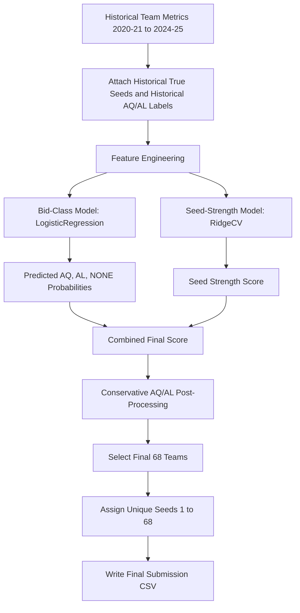
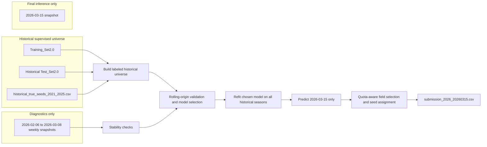
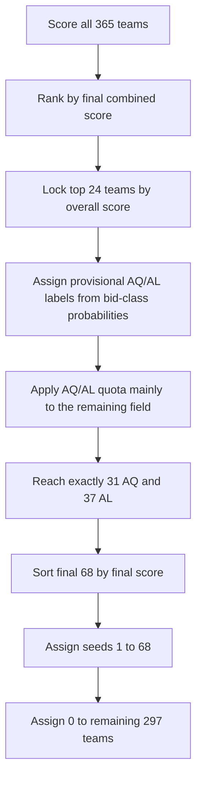

# Final-Four-Analytics-Challenge-26

This repository now reflects the final private `v8` NCAA seed prediction pipeline for the `2025-26` season.

The documentation is intentionally structured with the final production path first and the older Kaggle-style iteration history at the bottom. A reader should be able to understand what was submitted, how it was produced, what data was used, and why the model was chosen without reading the source code.

## 1) Final Deliverables

Final competition submission file:

- `submissions/final/submission_2026_20260315.csv`

Final production code:

- `code/build_submission_v8_final.py`
- `code/private_features.py`
- `code/build_historical_true_seeds.py`

Colab-ready notebook for rerunning the full pipeline:

- `kaggle/final_private_2026_v8_colab.ipynb`

Presentation-ready diagram pack:

- `docs/diagrams.md`
- `docs/assets/*.svg`
- `docs/assets/*.png`

Supporting evaluation artifacts:

- `artifacts/final_20260315_eval/`
- `artifacts/final_20260315_eval/final_selection_audit_v8.csv`
- `artifacts/final_20260315_eval/feature_importance_v8.csv`

## 2) Final Executive Summary

The final model predicts the `2025-26` NCAA men’s tournament field and seed order from the `2026-03-15` snapshot using a historically validated, leakage-aware pipeline.

Final production setup:

- historical training universe: `2020-21` through `2024-25`
- target labels: historical true seeds plus historical `AQ / AL / NONE`
- final inference snapshot: `data/raw/NCAA_Seed_Test_Set_2026_20260315.csv`
- final field rule: exactly `68` selected teams
- bid composition rule: exactly `31 AQ` and `37 AL`
- output rule: selected teams receive unique seeds `1..68`, all others receive `0`

Final selected model:

- candidate: `exp3_logit_bid_ridge_seed`
- bid-class model: `LogisticRegression`
- seed-strength model: `RidgeCV`

Why this model was shipped:

- it was the simplest final pipeline that still captured both tournament entry path and seed ordering
- it stayed aligned with the private one-shot prediction setting after the final quota correction
- it was easier to explain and defend than the boosted and ensemble alternatives
- it handled the top of the bracket more realistically after the conservative automatic-bid and at-large adjustment pass

What worked in the final design:

- rebuilding a fully labeled historical universe instead of relying on censored training rows
- separating bid-path prediction from seed-strength ranking
- using committee-style feature engineering rather than generic feature dumping
- applying quota logic mainly in the back half of the field instead of forcing it across the full ranking

What did not work as well:

- earlier quota-heavy logic that distorted the top seed lines
- more complex boosted and blended candidates that added complexity without improving the final production path enough to justify shipping them
- earlier private versions that still learned from incomplete historical tournament labels

Final submission checks:

- rows: `365`
- columns: `RecordID,Overall Seed`
- nonzero predictions: `68`
- nonzero seed set: exactly `1..68`
- zeros: `297`

## 3) What Actually Happened

The final production path was not a straight line from the earlier Kaggle versions.

The final sequence was:

1. Earlier repository versions (`v1` to `v6`) were built around Kaggle-style evaluation and partial-label assumptions.
2. `v7` moved the project into a private-prediction setting and removed dependence on test-time `Bid Type`.
3. `v8` upgraded the project from censored labels to a fully labeled historical universe by attaching true seeds for all historical selected teams from `2020-21` through `2024-25`.
4. The final model family evaluated inclusion and seed ordering separately.
5. The first AQ/AL quota implementation was too aggressive and distorted the top seed lines.
6. The final correction locked the top `24` teams by overall score first and applied the `AQ / AL` quota mainly in the back half of the field.
7. After that conservative pass, `exp3_logit_bid_ridge_seed` became the final winner.

This matters because the final README should reflect the actual shipped logic, not the intermediate model that won under an earlier post-processing rule.

## 4) Data Used in the Final Pipeline

### Historical training and labeling inputs

These files were used to build the historical labeled universe:

- `data/raw/NCAA_Seed_Training_Set2.0.csv`
- `data/raw/NCAA_Seed_Test_Set2.0.csv`
- `data/external/historical_true_seeds_2021_2025.csv`

How they are used:

- `NCAA_Seed_Training_Set2.0.csv` provides official historical feature rows.
- `NCAA_Seed_Test_Set2.0.csv` is merged back by season to reconstruct the full historical team universe.
- `historical_true_seeds_2021_2025.csv` supplies the true overall seed labels for selected historical teams and allows `AQ / AL / NONE` labels to be reconstructed cleanly.

### Weekly 2026 diagnostics only

These files were not used as training rows and were not pooled into the final inference row. They were used only for stability checks.

- `data/raw/NCAA_Seed_Test_Set_2026_20260206.csv`
- `data/raw/NCAA_Seed_Test_Set_2026_20260208.csv`
- `data/raw/NCAA_Seed_Test_Set_2026_20260215.csv`
- `data/raw/NCAA_Seed_Test_Set_2026_20260222.csv`
- `data/raw/NCAA_Seed_Test_Set_2026_20260301.csv`
- `data/raw/NCAA_Seed_Test_Set_2026_20260308.csv`

### Final inference input

Only this snapshot is used for the final competition prediction:

- `data/raw/NCAA_Seed_Test_Set_2026_20260315.csv`

### Output file used for competition submission

- `submissions/final/submission_2026_20260315.csv`

## 5) Leakage Policy

The final `v8` pipeline is built around explicit leakage constraints.

Rules enforced in the shipped path:

- no use of `Bid Type` as a known feature for the `2025-26` final test snapshot
- no use of tournament results, bracket outcomes, or post-selection information as predictors
- no random CV mixing seasons for final model selection
- no use of later weekly `2026` snapshots to help earlier predictions
- no use of the old Kaggle template row IDs as the final inference authority
- no fitting of scalers, clipping rules, encoders, or fusion weights on holdout seasons
- no raw `Team` identity in the final production model

Important nuance:

- historical `Bid Type` is used only as a historical label target for `AQ / AL / NONE`
- it is not treated as known information for the `2026-03-15` snapshot

## 6) Final Pipeline Overview

### High-level flow



### Production flow with data boundaries



### Final AQ/AL post-processing logic



This final post-processing rule is the key production correction that made the field more realistic. It keeps the top seed lines driven by overall team strength rather than forcing too many auto-bids into the top of the bracket.

## 7) Final Feature Engineering

The final model uses committee-style résumé features derived only from information available before bracket selection.

### Record parsing

The following string columns are parsed into wins, losses, games, win rate, loss rate, and margin features:

- `WL`
- `Conf.Record`
- `Non-ConferenceRecord`
- `RoadWL`
- `Quadrant1`
- `Quadrant2`
- `Quadrant3`
- `Quadrant4`

The parser explicitly repairs spreadsheet-converted artifacts such as `8-Sep`, `Apr-00`, and `Jun-00`.

### Core résumé features

The final pipeline builds features such as:

- overall win rate
- conference win rate
- non-conference win rate
- road win rate
- quadrant-specific win rates
- `Q1` wins
- `Q1 + Q2` wins
- `Q3 + Q4` loss counts
- bad loss rates
- quality win score
- bad loss penalty
- résumé balance
- résumé efficiency
- top résumé index

### Ranking and movement features

The model also uses:

- `NET Rank`
- `PrevNET`
- `NET delta = PrevNET - NET Rank`
- absolute NET movement
- NET improvement / worsening flags
- inverse and log transforms of rank-style columns

### Schedule and committee-context features

Additional context features include:

- `NETSOS`
- `NETNonConfSOS`
- `SOS gap`
- road-quality and non-conference quality interactions
- season-relative percentiles and z-scores
- conference context means and team-minus-conference deltas
- threshold features for `NET <= 10`, `16`, `25`, `45`, `50`, `75`

Final implementation:

- `code/private_features.py`

## 8) Final Model Components

### Bid-class model

Model used:

- `LogisticRegression`

Target:

- `NONE`
- `AQ`
- `AL`

Purpose:

- estimate whether a team is likely out of the field, an automatic qualifier, or an at-large team
- produce `P_AQ` and `P_AL`
- provide an inclusion signal through `P_AQ + P_AL`

### Seed-strength model

Model used:

- `RidgeCV`

Target:

- seed strength derived from historical selected teams

Purpose:

- rank likely tournament teams by overall seed strength in a stable, interpretable way

### Final score combination

The final rank score combines:

- normalized seed-strength score
- normalized inclusion signal

The exact selected field is then created through conservative quota-aware post-processing.

## 9) Validation Framework

The final production model was chosen using temporally realistic validation rather than random cross-validation or leaderboard-style iteration.

### Primary historical validation

The main screening pass used rolling-origin season splits:

- `2020-21 + 2021-22 -> 2022-23`
- `2020-21 + 2021-22 + 2022-23 -> 2023-24`
- `2020-21 + 2021-22 + 2022-23 + 2023-24 -> 2024-25`

This made the validation setup look more like the real forecasting problem, where the model has to learn from past seasons and predict a future one.

The shortlist was judged using three types of checks:

- overall seed-order quality across the full season universe
- tournament-field quality, especially near the bubble
- ranking stability and realism after post-processing

### Secondary validation

Leave-one-season-out validation was used as a secondary stress test once the shortlist was small enough to compare carefully.

### 2026 stability diagnostics

The final shortlist was also scored on every weekly `2026` snapshot without refitting.

Those weekly checks were used to answer questions like:

- does the projected field change too aggressively from week to week
- do the top seed lines remain stable near Selection Sunday
- does the post-processing behave realistically when the bubble tightens

### What worked and what did not

What worked:

- season-blocked validation instead of mixed-season random folds
- separating historical model selection from final March 15 inference
- using weekly `2026` snapshots as a stability check rather than as extra training data

What did not work:

- earlier evaluation setups that assumed partial labels were complete labels
- more complex candidate families that were harder to stabilize near the bubble
- aggressive quota logic before the final conservative correction

## 10) Final 2026 Field Snapshot

Current top `12` predicted seeds from the final audit:

| Seed | Team | Predicted Bid Type |
|---:|---|---|
| 1 | Michigan | AL |
| 2 | Duke | AL |
| 3 | Arizona | AQ |
| 4 | Houston | AQ |
| 5 | Florida | AL |
| 6 | Virginia | AQ |
| 7 | Illinois | AL |
| 8 | Iowa St. | AL |
| 9 | Purdue | AL |
| 10 | Michigan St. | AL |
| 11 | Louisville | AL |
| 12 | Vanderbilt | AL |

Last `8` teams in the projected field:

| Seed | Team | Predicted Bid Type |
|---:|---|---|
| 61 | LSU | AL |
| 62 | New Mexico | AL |
| 63 | Notre Dame | AL |
| 64 | Miami (OH) | AQ |
| 65 | Marquette | AQ |
| 66 | Tulsa | AQ |
| 67 | SFA | AQ |
| 68 | McNeese | AQ |

Source:

- `artifacts/final_20260315_eval/final_selection_audit_v8.csv`

## 11) How to Reproduce the Final Submission

### Local command-line run

```bash
python3 code/build_submission_v8_final.py --skip-seed-build
```

This writes:

- `submissions/final/submission_2026_20260315.csv`
- all main evaluation artifacts under `artifacts/final_20260315_eval/`

### Colab notebook run

Use:

- `kaggle/final_private_2026_v8_colab.ipynb`

The notebook includes:

- package install
- file checks and optional uploads
- historical true-seed build fallback
- rolling-origin validation
- shortlist selection
- final retraining and final CSV export

## 12) Repository Structure Relevant to the Final Pipeline

```text
final-four-analytics-challenge-26/
├── README.md
├── requirements.txt
├── code/
│   ├── build_historical_true_seeds.py
│   ├── build_submission_v7_private.py
│   ├── build_submission_v8_final.py
│   ├── build_submission_v8_kaggle_backtest.py
│   ├── private_features.py
│   └── private_validation.py
├── data/
│   ├── raw/
│   │   ├── NCAA_Seed_Training_Set2.0.csv
│   │   ├── NCAA_Seed_Test_Set2.0.csv
│   │   ├── NCAA_Seed_Test_Set_2026_20260206.csv
│   │   ├── NCAA_Seed_Test_Set_2026_20260208.csv
│   │   ├── NCAA_Seed_Test_Set_2026_20260215.csv
│   │   ├── NCAA_Seed_Test_Set_2026_20260222.csv
│   │   ├── NCAA_Seed_Test_Set_2026_20260301.csv
│   │   ├── NCAA_Seed_Test_Set_2026_20260308.csv
│   │   └── NCAA_Seed_Test_Set_2026_20260315.csv
│   └── external/
│       └── historical_true_seeds_2021_2025.csv
├── artifacts/
│   ├── final_20260315_eval/
│   └── kaggle_backtest_v8/
├── kaggle/
│   └── final_private_2026_v8_colab.ipynb
└── submissions/
    ├── final/
    │   └── submission_2026_20260315.csv
    └── kaggle_backtest/
        └── submission_kaggle_v8_exp3_loocv.csv
```

## 13) Historical Kaggle Backtest Using the Final Model Family

A leakage-aware historical Kaggle-format backtest was also created using the same `v8` family.

Files:

- `code/build_submission_v8_kaggle_backtest.py`
- `submissions/kaggle_backtest/submission_kaggle_v8_exp3_loocv.csv`
- `artifacts/kaggle_backtest_v8/kaggle_loyo_full_universe_metrics.csv`
- `artifacts/kaggle_backtest_v8/kaggle_test_predictions_with_truth.csv`

Important note:

- this is an out-of-season backtest artifact
- it is not the production `2025-26` competition submission
- it was generated specifically to avoid scoring the historical Kaggle test rows in-sample

## 14) Research and Strategy Review

This project reviewed several modeling ideas before the final `v8` choice.

### Strategies retained

- committee-style résumé feature engineering
- temporally realistic validation
- simple linear and regularized models for stability
- explicit separation of bid-class prediction and seed-strength ranking
- conservative post-processing to produce a realistic final field

### Strategies tested but not shipped

- `LightGBMClassifier` inclusion model
- `LightGBMRegressor` seed model
- `CatBoostRegressor` seed model
- CFA-style weighted reciprocal-rank fusion
- seed ensembles

### Strategies explicitly rejected

- test-time `Bid Type` as a known feature for `2025-26`
- random cross-validation for final model choice
- deep stacking
- TabNet as a production path
- Transformers
- LSTMs on weekly data
- public-leaderboard hedging logic

Why deep models were not adopted:

- the historical sample size is small for deep tabular learning
- the training target is noisy and highly structured by committee behavior
- tree and linear baselines remained more stable and easier to validate

## 15) Iterative Development History

The repository includes earlier versions because they were part of the path that led to `v8`.

### Version summary

| Version | Core Idea | Main Model Family | Main Weakness | Current Status |
|---|---|---|---|---|
| `v1` | early seed-selection baseline | `XGBoost` classifier + regressor | censored labels, Kaggle framing | archive |
| `v2` | cleaner leakage-safe baseline | `XGBoost` classifier + regressor | still depends on partial-label assumptions | archive |
| `v3` | richer features and constrained season assignment | `XGBoost` family | relied on `Bid Type` hints in the Kaggle setting | archive |
| `v4` | seeded-team ranking approach | `Ridge + tree models` | assumes selected rows are already known | archive |
| `v5` | modular experiment framework | linear + boosting families | mixed success, no final private path | research archive |
| `v6` | leaderboard hedge around earlier Kaggle winner | blended heuristic | not a private forecasting pipeline | archive |
| `v7` | first private pipeline | `Ridge + private validation` | trained from censored labels only | replaced by `v8` |
| `v8` | full historical-label upgrade | `LogisticRegression + RidgeCV` | still limited by bubble-team uncertainty | final production path |

### Why the older work is still documented

The older sections remain useful because they explain:

- which feature ideas helped or failed
- why `Bid Type` had to be reinterpreted in the private setting
- why some stronger-looking Kaggle artifacts are not valid final choices for `2025-26`
- how the project moved from leaderboard-oriented iteration to one-shot private forecasting

## 16) Earlier Competition-Facing Artifacts and Archives

Earlier competition-era folders are preserved for traceability.

Main archive folders:

- `submissions/generated/`
- `submissions/legacy/`
- `submissions/no_external_best/`
- `submissions/v3_no_external/`
- `submissions/v3_ensemble/`
- `submissions/v4_selected_seed/`
- `submissions/v5_experiments/`
- `submissions/v5_ensemble/`
- `submissions/v6/`

How to interpret them now:

- they are part of the project history
- they are not the final private `2025-26` production submission
- they should not override the `v8` path documented above

## 17) Final Recommendation

If you only need the production assets, use these four files:

- final submission: `submissions/final/submission_2026_20260315.csv`
- final driver: `code/build_submission_v8_final.py`
- final feature pipeline: `code/private_features.py`
- Colab notebook: `kaggle/final_private_2026_v8_colab.ipynb`

Everything else in the repository is supporting context, validation evidence, or historical development history.
