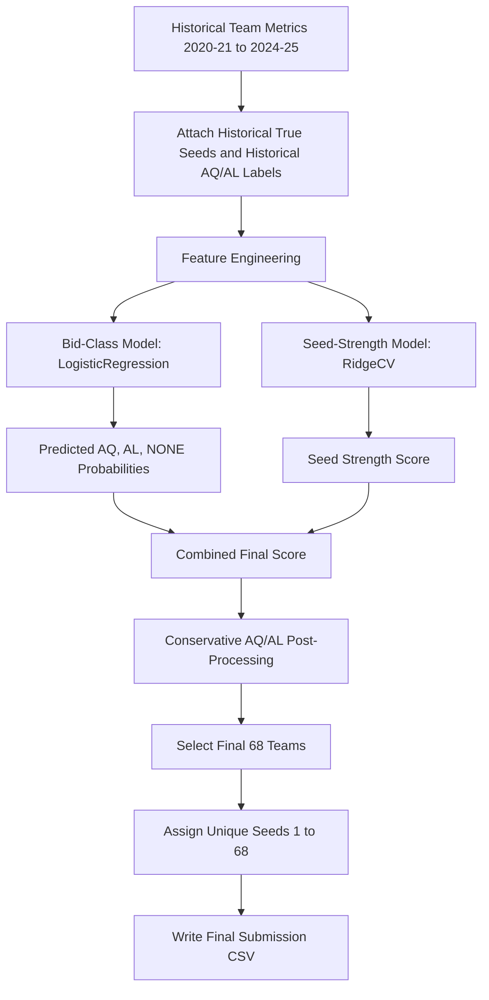
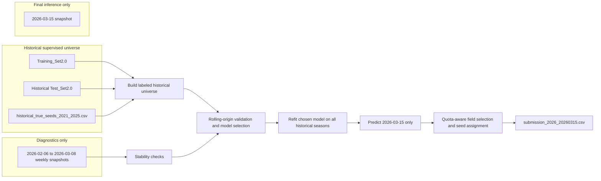
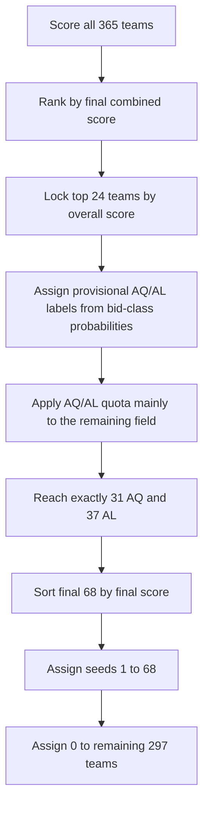

# Final V8 Presentation Diagrams

This file isolates the final production visuals from the full project README so they can be reused in slides, reports, and video walkthroughs.

## 1) End-to-End Final Pipeline

## 2) Data Boundaries and Leakage Control

## 3) AQ/AL Post-Processing Logic

## 4) Suggested Presentation Order

1. Start with the end-to-end pipeline to establish the modeling structure.
2. Use the data-boundary diagram to explain leakage controls and why weekly snapshots are diagnostics only.
3. Finish with the AQ/AL diagram to explain how the final 68-team field is converted into realistic seeds.
